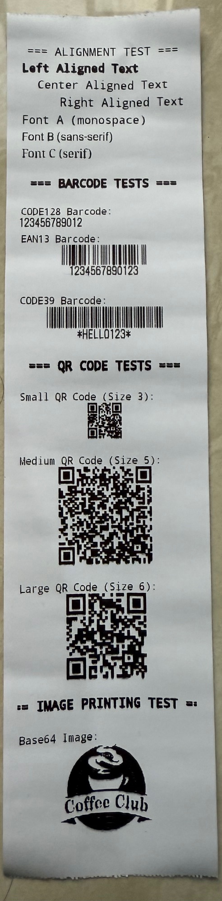

# React Native Thermal POS Printer

A React Native library for thermal POS printers with support for Bluetooth, USB, WiFi, and Ethernet connections. Features object-oriented device management and comprehensive printing capabilities.

## Features

- 🖨️ **Multiple Printer Support**: Xprinter, Epson, Star Micronics, Citizen, Bixolon, and any ESC/POS compatible printer
- 🔗 **Multiple Connection Types**: Bluetooth, USB, WiFi, Ethernet
- 📱 **Object-Oriented API**: New device-centric approach with backward compatibility
- 🎯 **Device Management**: Connect to multiple printers simultaneously
- 📄 **Rich Printing**: Text formatting, images, QR codes, barcodes
- 🔧 **Auto-linking**: React Native 0.60+ auto-linking support
- 📊 **Device Status**: Real-time printer status monitoring
- 🛡️ **Type Safety**: Full TypeScript support
- 🔍 **Device Discovery**: Automatic Bluetooth device discovery
- ⚡ **Performance**: Optimized for speed and reliability

## Installation

### React Native 0.60+ (Auto-linking)

```bash
npm install react-native-thermal-pos-printer
```

### Manual Linking (React Native < 0.60)

```bash
npm install react-native-thermal-pos-printer
react-native link react-native-thermal-pos-printer
```

## Setup

### iOS Setup

1. Run pod install:
```bash
cd ios && pod install
```

2. Add Bluetooth permissions to `Info.plist`:
```xml
<key>NSBluetoothAlwaysUsageDescription</key>
<string>This app needs Bluetooth access to connect to thermal printers</string>
<key>NSBluetoothPeripheralUsageDescription</key>
<string>This app needs Bluetooth access to connect to thermal printers</string>
```

### Android Setup

1. Add Bluetooth permissions to `android/app/src/main/AndroidManifest.xml`:
```xml
<uses-permission android:name="android.permission.BLUETOOTH" />
<uses-permission android:name="android.permission.BLUETOOTH_ADMIN" />
<uses-permission android:name="android.permission.ACCESS_COARSE_LOCATION" />
<uses-permission android:name="android.permission.ACCESS_FINE_LOCATION" />

<!-- For Android 12+ -->
<uses-permission android:name="android.permission.BLUETOOTH_SCAN" android:usesPermissionFlags="neverForLocation" />
<uses-permission android:name="android.permission.BLUETOOTH_CONNECT" />
<uses-permission android:name="android.permission.BLUETOOTH_ADVERTISE" />
```

## Usage

### New Object-Oriented Approach (Recommended)

```typescript
import { ReactNativePosPrinter, ThermalPrinterDevice } from 'react-native-thermal-pos-printer';

// Initialize the printer module
await ReactNativePosPrinter.init();

// Get available devices as ThermalPrinterDevice instances
const devices: ThermalPrinterDevice[] = await ReactNativePosPrinter.getDeviceList();
console.log('Available devices:', devices);

// Connect to a specific device
const printer = devices[0];
if (printer) {
  // Connect with options
  await printer.connect({ 
    timeout: 5000, 
    encoding: 'UTF-8' 
  });
  
  // Print using the device instance
  await printer.printText('Hello World!', {
    align: 'CENTER',
    size: 24,
    bold: true
  });
  
  // Check device status
  const status = await printer.getStatus();
  console.log('Printer status:', status);
  
  // Print image
  await printer.printImage(base64Image, {
    align: 'CENTER',
    width: 300
  });
  
  // Disconnect
  await printer.disconnect();
}

// Get a specific device by address
const specificPrinter = await ReactNativePosPrinter.getDevice('00:11:22:33:44:55');
if (specificPrinter) {
  await specificPrinter.connect();
  await specificPrinter.printText('Connected to specific printer!');
}

// Discover nearby Bluetooth devices
const discoveredDevices = await ReactNativePosPrinter.discoverDevices(10000);
console.log('Discovered devices:', discoveredDevices);
```

### Legacy Static Methods (Still Supported)

```typescript
import ReactNativePosPrinter from 'react-native-thermal-pos-printer';

// Initialize the printer
await ReactNativePosPrinter.init();

// Get available devices (legacy method)
const devices = await ReactNativePosPrinter.getDeviceList();

// Connect to a printer (legacy method)
await ReactNativePosPrinter.connectPrinter(device.address, { type: 'BLUETOOTH' });


// Print text with numeric font size
await ReactNativePosPrinter.printText('Hello World!', {
  align: 'CENTER',
  size: 24,  // Numeric font size
  bold: true,
  fontType: 'A'
});

// Cut paper
await ReactNativePosPrinter.cutPaper();
```

### Advanced Device Management

```typescript
// Multiple device management
const devices = await ReactNativePosPrinter.getDeviceList();
const connectedDevices: ThermalPrinterDevice[] = [];

// Connect to multiple devices
for (const device of devices) {
  try {
    await device.connect({ timeout: 3000 });
    connectedDevices.push(device);
    console.log(`Connected to ${device.name}`);
  } catch (error) {
    console.log(`Failed to connect to ${device.name}:`, error);
  }
}

// Print to all connected devices
for (const device of connectedDevices) {
  await device.printText(`Hello from ${device.name}!`);
}

// Check connection status
for (const device of connectedDevices) {
  const isConnected = await device.isConnected();
  console.log(`${device.name} connected: ${isConnected}`);
}
```

### Complete Receipt Example

```typescript
const printAdvancedReceipt = async (printer: ThermalPrinterDevice) => {
  try {
    // Ensure device is connected
    if (!await printer.isConnected()) {
      await printer.connect();
    }
    
    // Print logo (base64 image)
    const logoBase64 = 'iVBORw0KGgoAAAANSUhEUgAAAAEAAAABCAYAAAAfFcSJAAAADUlEQVR42mP8/5+hHgAHggJ/PchI7wAAAABJRU5ErkJggg==';
    await printer.printImage(logoBase64, {
      align: 'CENTER',
      width: 200,
      height: 100
    });
    
    // Header with large font
    await printer.printText('MY STORE', {
      align: 'CENTER',
      size: 36,  // Large numeric font size
      bold: true,
      fontType: 'A'
    });
    
    await printer.printText('123 Main St, City, State', {
      align: 'CENTER',
      size: 18  // Medium numeric font size
    });
    
    await printer.printText('Tel: (555) 123-4567', {
      align: 'CENTER',
      size: 12  // Small numeric font size
    });
    
    await printer.printText('\n' + '='.repeat(32) + '\n');
    
    // Items
    await printer.printText('Item 1                    $10.00');
    await printer.printText('Item 2                    $15.00');
    await printer.printText('Tax                        $2.50');
    
    await printer.printText('\n' + '-'.repeat(32) + '\n');
    
    // Total with large font
    await printer.printText('TOTAL                     $27.50', {
      bold: true,
      size: 24  // Large numeric font size
    });
    
    // QR Code with high error correction
    await ReactNativePosPrinter.printQRCode('https://mystore.com/receipt/123', {
      align: 'CENTER',
      size: 6,
      errorLevel: 'H'
    });
    
    await printer.printText('\nThank you for your business!\n', {
      align: 'CENTER'
    });
    
    // Check status before cutting
    const status = await printer.getStatus();
    if (status.online && !status.paperOut) {
      await ReactNativePosPrinter.cutPaper();
    }
    
  } catch (error) {
    console.error('Print error:', error);
  }
};
```

## API Reference

### ThermalPrinterDevice Class

#### Properties
- `name: string` - Device name
- `address: string` - Device address (MAC address for Bluetooth)
- `id: string` - Unique device identifier
- `type: 'BLUETOOTH' | 'USB' | 'WIFI' | 'ETHERNET'` - Connection type
- `connected: boolean` - Current connection status
- `rssi?: number` - Signal strength (Bluetooth only)
- `batteryLevel?: number` - Battery level (if supported)
- `bondState?: number` - Bluetooth bond state
- `deviceClass?: string` - Device class information

#### Methods

##### `connect(options?: ConnectionOptions): Promise<boolean>`
Connect to this specific printer device.

```typescript
interface ConnectionOptions {
  timeout?: number;           // Connection timeout in ms
  encoding?: 'UTF-8' | 'GBK' | 'GB2312' | 'BIG5';
  delimiter?: string;         // Message delimiter
  secure?: boolean;          // Use secure connection
}
```

##### `isConnected(): Promise<boolean>`
Check if this device is currently connected.

##### `disconnect(): Promise<boolean>`
Disconnect from this device.

##### `printText(text: string, options?: TextOptions): Promise<boolean>`
Print text using this specific device.

##### `printImage(base64: string, options?: ImageOptions): Promise<boolean>`
Print image using this specific device.

##### `getStatus(): Promise<PrinterStatus>`
Get printer status for this specific device.

### ReactNativePosPrinter Static Methods

#### `init(): Promise<boolean>`
Initialize the printer module.

#### `getDeviceList(): Promise<ThermalPrinterDevice[]>`
Get list of available devices as ThermalPrinterDevice instances.

#### `getDevice(address: string): Promise<ThermalPrinterDevice | null>`
Get a specific device by address.

#### `discoverDevices(timeout?: number): Promise<ThermalPrinterDevice[]>`
Discover nearby Bluetooth devices.

#### Legacy Methods (Still Supported)

#### `getDeviceList(): Promise<PrinterDevice[]>`
Get list of available printer devices (legacy format).

#### `connectPrinter(address: string, type: string): Promise<boolean>`
Connect to a printer device (legacy method).

#### `disconnectPrinter(): Promise<boolean>`
Disconnect from the current printer (legacy method).

#### `isConnected(): Promise<boolean>`
Check if printer is connected (legacy method).

#### `printText(text: string, options?: TextOptions): Promise<boolean>`
Print text with formatting options (legacy method).

#### `printImage(base64: string, options?: ImageOptions): Promise<boolean>`
Print image from base64 string (legacy method).

#### `printQRCode(data: string, options?: QRCodeOptions): Promise<boolean>`
Print QR code (legacy method).

#### `printBarcode(data: string, type: string, options?: BarcodeOptions): Promise<boolean>`
Print barcode (legacy method).

#### `cutPaper(): Promise<boolean>`
Cut paper (legacy method).

#### `openCashDrawer(): Promise<boolean>`
Open cash drawer (legacy method).

#### `newLine(lines?: number): Promise<void>`
Add vertical spacing by printing line feeds. The `lines` parameter specifies the number of line feeds to print (default: 1, range: 1-10).

```typescript
// Add single line feed
await ReactNativePosPrinter.newLine();

// Add multiple line feeds for more spacing
await ReactNativePosPrinter.newLine(3);

// Maximum allowed lines
await ReactNativePosPrinter.newLine(10);
```

### Types

```typescript
interface ThermalPrinterNativeDevice {
  name: string;
  address: string;
  id: string;
  type: 'BLUETOOTH' | 'USB' | 'WIFI' | 'ETHERNET';
  connected: boolean;
  rssi?: number;
  batteryLevel?: number;
  bondState?: number;
  deviceClass?: string;
  extra?: Map<string, Object>;
}

interface PrinterDevice {
  name: string;
  address: string;
  type: 'BLUETOOTH' | 'USB' | 'WIFI' | 'ETHERNET';
  connected: boolean;
  rssi?: number;
  batteryLevel?: number;
}

interface ConnectionOptions {
  timeout?: number;
  encoding?: 'UTF-8' | 'GBK' | 'GB2312' | 'BIG5';
  delimiter?: string;
  secure?: boolean;
}

interface PrintOptions {
  encoding?: 'UTF-8' | 'GBK' | 'GB2312' | 'BIG5';
  codepage?: number;
  width?: number;
  height?: number;
  beep?: boolean;
  cut?: boolean;
  tailingLine?: boolean;
  openCashBox?: boolean;
  copies?: number;
}

interface TextOptions {
  align?: 'LEFT' | 'CENTER' | 'RIGHT';
  size?: 'SMALL' | 'NORMAL' | 'LARGE' | 'XLARGE' | number;
  bold?: boolean;
  underline?: boolean;
  fontType?: 'A' | 'B' | 'C';
  italic?: boolean;
  strikethrough?: boolean;
  doubleStrike?: boolean;
  invert?: boolean;
  rotate?: 0 | 90 | 180 | 270;
}

interface ImageOptions {
  width?: number;
  height?: number;
  align?: 'LEFT' | 'CENTER' | 'RIGHT';
  threshold?: number;
  dithering?: boolean;
}

interface BarcodeOptions {
  width?: number;
  height?: number;
  align?: 'LEFT' | 'CENTER' | 'RIGHT';
  textPosition?: 'NONE' | 'ABOVE' | 'BELOW' | 'BOTH';
  fontSize?: number;
  hri?: boolean;
}

interface QRCodeOptions {
  size?: number;
  align?: 'LEFT' | 'CENTER' | 'RIGHT';
  errorLevel?: 'L' | 'M' | 'Q' | 'H';
  model?: 1 | 2;
}

interface PrinterStatus {
  online: boolean;
  paperOut: boolean;
  coverOpen: boolean;
  cutterError: boolean;
  temperature: 'NORMAL' | 'HIGH';
  voltage: 'NORMAL' | 'LOW';
}
```

### Font Size Support

The library supports numeric font sizes with the following mapping:

| Font Size Range | Effect | Multiplier |
|----------------|--------|-----------||
| ≤ 12 | Normal size | 0x0 |
| 13-18 | Small increase | 0x1 |
| 19-24 | Medium size | 0x2 |
| 25-36 | Large size | 0x3 |
| 37-48 | Extra large | 0x4 |
| > 48 | Maximum size | 0x5 |

**Examples:**
```typescript
// Normal size
await printer.printText('Normal text', { size: 12 });

// Medium size
await printer.printText('Medium text', { size: 24 });

// Large size
await printer.printText('Large text', { size: 36 });

// Maximum size
await printer.printText('Max text', { size: 48 });
```

### Supported Barcode Types

- **CODE128** - High-density linear barcode
- **CODE39** - Alphanumeric barcode
- **EAN13** - European Article Number (13 digits)
- **EAN8** - European Article Number (8 digits)
- **UPC_A** - Universal Product Code
- **UPC_E** - Universal Product Code (compact)
- **ITF** - Interleaved 2 of 5
- **CODABAR** - Variable-length barcode

### QR Code Error Correction Levels

- **L** - Low (~7% correction)
- **M** - Medium (~15% correction) - Default
- **Q** - Quartile (~25% correction)
- **H** - High (~30% correction)

## Supported Printers

- Xprinter (XP-58, XP-80, XP-365B, etc.)
- Epson (TM series)
- Star Micronics
- Citizen
- Bixolon
- Any ESC/POS compatible thermal printer

## Demo Print Image

Below is a sample print image used in the example app:



## Migration Guide

### From Legacy to Object-Oriented Approach

**Before (Legacy):**
```typescript
// Old way
const devices = await ReactNativePosPrinter.getDeviceList();
await ReactNativePosPrinter.connectPrinter(devices[0].address, 'BLUETOOTH');
await ReactNativePosPrinter.printText('Hello World!');
await ReactNativePosPrinter.disconnectPrinter();
```

**After (Recommended):**
```typescript
// New way
const devices = await ReactNativePosPrinter.getDeviceList();
const printer = devices[0];
await printer.connect();
await printer.printText('Hello World!');
await printer.disconnect();
```

### Benefits of New Approach

1. **Better state management** - Each device tracks its own connection state
2. **Type safety** - Full TypeScript support with proper interfaces
3. **Cleaner API** - Device-specific methods instead of global static methods
4. **Multiple device support** - Easy to manage multiple printers simultaneously
5. **Better error handling** - Device-specific error messages
6. **Extensibility** - Easy to add device-specific features

## Troubleshooting

### Common Issues

1. **Package doesn't seem to be linked**
   - For React Native 0.60+: Delete any `react-native.config.js` from the library directory
   - Clean and rebuild: `cd android && ./gradlew clean && cd .. && npx react-native run-android`
   - For manual linking: Add config to your main app's `react-native.config.js`

2. **Bluetooth connection fails**
   - Ensure the printer is paired with the device
   - Check Bluetooth permissions (especially for Android 12+)
   - Make sure the printer is in pairing mode
   - Use device discovery: `await ReactNativePosPrinter.discoverDevices()`

3. **Print quality issues**
   - Check paper alignment
   - Ensure proper paper type (thermal paper)
   - Verify printer settings
   - Check device status: `await printer.getStatus()`

4. **Characters not printing correctly**
   - Set proper encoding in connection options: `{ encoding: 'UTF-8' }`
   - Use appropriate codepage for your region

5. **Image not printing**
   - Ensure base64 string is valid
   - Check image dimensions (recommended max width: 384px)
   - Verify image format is supported (PNG, JPEG)

6. **Barcode/QR code issues**
   - Verify data format matches barcode type
   - Check size parameters are within printer limits
   - Ensure sufficient paper width for barcode

7. **Font size not working**
   - Use numeric values (12, 24, 36, 48) instead of string values
   - Ensure the printer supports the ESC/POS font size commands
   - Note: iOS implementation may need additional font size command implementation

8. **Multiple device management**
   - Use the new object-oriented approach for better device management
   - Check connection status before operations: `await device.isConnected()`
   - Handle device-specific errors appropriately

## React Native Version Compatibility

| Package Version | React Native Version | Notes |
|----------------|---------------------|-------|
| 1.3.x | >= 0.70.0 | Auto-linking support, Android 12+ permissions |
| 1.2.x | >= 0.60.0 < 0.73.0 | Auto-linking support |
| 1.1.x | >= 0.60.0 | Basic auto-linking |
| 1.0.x | < 0.60.0 | Manual linking required |

## Contributing

Contributions are welcome! Please read our contributing guidelines and submit pull requests.

### Development Setup

```bash
# Clone the repository
git clone https://github.com/your-username/react-native-thermal-pos-printer.git

# Install dependencies
npm install

# Build the package
npm run prepack

# Run tests
npm test
```

## License

MIT License - see LICENSE file for details.

## Changelog

### v1.3.3
- Added object-oriented device management with `ThermalPrinterDevice` class
- Improved auto-linking support for React Native 0.60+
- Enhanced device discovery and connection management
- Added device-specific status monitoring
- Better error handling with device-specific messages
- Support for Android 12+ Bluetooth permissions
- Backward compatibility with legacy static methods
- Enhanced TypeScript support with comprehensive interfaces